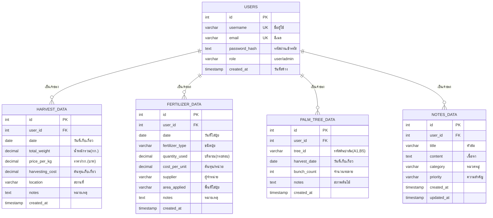

# 📊 Database Schema Visualization

## 🌴 Palm Oil Management System Database Structure

### 📋 Entity Relationship Diagram

```
┌─────────────────────────────────────────────────────────────┐
│                       🏢 USERS (ผู้ใช้งาน)                    │
├─────────────────────────────────────────────────────────────┤
│ • id (PK) - รหัสผู้ใช้                                        │
│ • username (UNIQUE) - ชื่อผู้ใช้                             │
│ • email (UNIQUE) - อีเมล                                    │
│ • password_hash - รหัsผ่านเข้ารหัส                            │
│ • role - บทบาท (user/admin)                                 │
│ • created_at - วันที่สร้างบัญชี                              │
└─────────────────────────────────────────────────────────────┘
                              │
                              │ (1:N)
                              ▼
┌─────────────────────────────────────────────────────────────┐
│                    🌾 HARVEST_DATA (การเก็บเกี่ยว)             │
├─────────────────────────────────────────────────────────────┤
│ • id (PK) - รหัสการเก็บเกี่ยว                                  │
│ • user_id (FK) - รหัสผู้ใช้                                   │
│ • date - วันที่เก็บเกี่ยว                                      │
│ • total_weight - น้ำหนักรวม (กิโลกรัม)                        │
│ • price_per_kg - ราคาต่อกิโลกรัม (บาท)                        │
│ • harvesting_cost - ต้นทุนการเก็บเกี่ยว                        │
│ • location - สถานที่เก็บเกี่ยว                                 │
│ • notes - หมายเหตุ                                           │
└─────────────────────────────────────────────────────────────┘

┌─────────────────────────────────────────────────────────────┐
│                   🌱 FERTILIZER_DATA (การใส่ปุ๋ย)              │
├─────────────────────────────────────────────────────────────┤
│ • id (PK) - รหัสการใส่ปุ๋ย                                     │
│ • user_id (FK) - รหัสผู้ใช้                                   │
│ • date - วันที่ใส่ปุ๋ย                                         │
│ • fertilizer_type - ชนิดปุ๋ย (NPK, ยูเรีย)                     │
│ • quantity_used - ปริมาณที่ใช้ (กระสอบ)                        │
│ • cost_per_unit - ต้นทุนต่อหน่วย                              │
│ • supplier - ผู้จำหน่าย/ร้านค้า                                │
│ • area_applied - พื้นที่ที่ใส่ปุ๋ย                             │
│ • notes - หมายเหตุ                                           │
└─────────────────────────────────────────────────────────────┘

┌─────────────────────────────────────────────────────────────┐
│                  🌴 PALM_TREE_DATA (ข้อมูลต้นปาล์ม)           │
├─────────────────────────────────────────────────────────────┤
│ • id (PK) - รหัสข้อมูลต้นปาล์ม                                 │
│ • user_id (FK) - รหัสผู้ใช้                                   │
│ • tree_id - รหัสต้นปาล์ม (A1, B5, C12)                       │
│ • harvest_date - วันที่เก็บเกี่ยว                             │
│ • bunch_count - จำนวนทะลาย                                   │
│ • notes - สภาพต้นไม้, โรคแมลง                                 │
└─────────────────────────────────────────────────────────────┘

┌─────────────────────────────────────────────────────────────┐
│                   📝 NOTES_DATA (บันทึกเพิ่มเติม)              │
├─────────────────────────────────────────────────────────────┤
│ • id (PK) - รหัสบันทึก                                        │
│ • user_id (FK) - รหัสผู้ใช้                                   │
│ • title - หัวข้อบันทึก                                        │
│ • content - เนื้อหาโดยละเอียด                                 │
│ • category - หมวดหมู่ (การเก็บเกี่ยว, ปุ๋ย, โรคแมลง)           │
│ • priority - ระดับความสำคัญ (สูง, ปานกลาง, ต่ำ)                │
│ • created_at - วันที่สร้าง                                   │
│ • updated_at - วันที่แก้ไขล่าสุด                              │
└─────────────────────────────────────────────────────────────┘
```

### 🔗 Data Flow & Relationships

```
👤 User Authentication
    │
    ├── 🔐 JWT Token Generation
    │
    ▼
📊 Data Access Layer
    │
    ├── 🌾 Harvest Management
    │   ├── Daily harvest recording
    │   ├── Revenue calculation
    │   └── Profit analysis
    │
    ├── 🌱 Fertilizer Management  
    │   ├── Cost tracking
    │   ├── Usage monitoring
    │   └── Supplier management
    │
    ├── 🌴 Palm Tree Monitoring
    │   ├── Individual tree tracking
    │   ├── Productivity analysis
    │   └── Health monitoring
    │
    └── 📝 Notes & Documentation
        ├── Knowledge management
        ├── Planning records
        └── Experience logging
```

### 📈 Data Analytics & Reports

```
Raw Data Input → Processing → Analytics → Reports
      │              │           │          │
      ▼              ▼           ▼          ▼
  Daily Records → Validation → Aggregation → Dashboard
  CSV Import    → Calculation → Trends     → Charts
  Manual Entry  → Statistics  → Forecasts → Exports
```